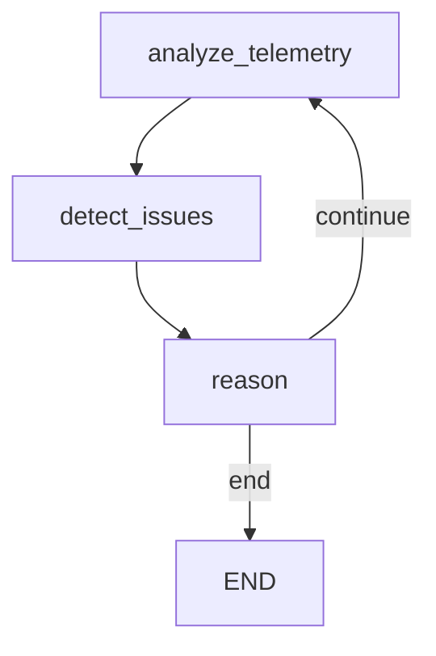

# LangGraph Migration Guide

This document provides a comprehensive guide for migrating from the legacy LangChain ReAct agents to the modern LangGraph state machine architecture.

## Overview

The LangGraph migration provides:
- **State Machine Architecture**: Explicit control flow with typed state management
- **Checkpointing**: Built-in state persistence and resume capability
- **Human-in-the-Loop**: Interrupt points for approval workflows
- **Observability**: Better visibility into agent reasoning and decision-making
- **Type Safety**: TypedDict schemas for reliable state management
- **Streaming**: Real-time output for long-running operations

## Architecture Comparison

### Legacy ReAct Pattern
```python
# Old approach
from langchain.agents import initialize_agent, AgentType

agent = initialize_agent(
    tools=[tool1, tool2],
    llm=llm,
    agent=AgentType.ZERO_SHOT_REACT_DESCRIPTION,
    verbose=True,
)

result = agent.invoke({"input": "Query"})
```

**Limitations:**
- Opaque control flow
- Limited state management
- No checkpointing
- Difficult to add conditional logic
- Hard to debug

### LangGraph State Machine
```python
# New approach
from langgraph.graph import StateGraph, END
from gen_engine_deep_eval.graphs.observer_graph import build_observer_graph

graph = build_observer_graph(llm, state_provider, max_iterations=5)
result = run_observer_graph(graph, "Query", thread_id="session-1")
```

**Benefits:**
- Explicit node definitions
- Typed state with TypedDict
- Built-in checkpointing
- Conditional edges for complex logic
- Easy to visualize and debug

## Observer Agent Migration

### State Schema
```python
class ObserverState(TypedDict):
    messages: Annotated[Sequence[dict], add]  # Conversation history
    current_snapshot: dict[str, Any] | None    # Latest telemetry
    detected_anomalies: dict[str, Any] | None  # Anomaly results
    analysis_history: Annotated[list[dict], add]  # Past analyses
    iteration_count: int                       # Loop control
    final_answer: str | None                   # Summary
```

### Graph Nodes

1. **analyze_telemetry**: Fetches latest snapshot
2. **detect_issues**: Runs anomaly detection
3. **reason**: LLM analyzes and recommends actions
4. **should_continue**: Conditional edge based on severity

### Usage Example

```python
from gen_engine_deep_eval.wrapper import GenerativeEngineLLM
from gen_engine_deep_eval.observer_agent import DigitalTwinState, generate_sample
from gen_engine_deep_eval.graphs.observer_graph import build_observer_graph, run_observer_graph

# Setup
llm = GenerativeEngineLLM(model="anthropic.claude-3-5-sonnet-20240620-v1:0", ...)
state_provider = DigitalTwinState()

# Seed telemetry
for i in range(30):
    state_provider.add(generate_sample(float(i)))

# Build and run
graph = build_observer_graph(llm, state_provider, max_iterations=5)
result = run_observer_graph(graph, "Assess network health", thread_id="demo-1")

# Access results
print(f"Anomalies: {result['detected_anomalies']}")
print(f"Final answer: {result['final_answer']}")
```

### Checkpointing

```python
from langgraph.checkpoint.memory import MemorySaver

checkpointer = MemorySaver()
graph = build_observer_graph(llm, state_provider, checkpointer=checkpointer)

# First run
result1 = run_observer_graph(graph, "Start analysis", thread_id="session-1")

# Resume from checkpoint
result2 = run_observer_graph(graph, "Continue", thread_id="session-1")
```

## DataCenter Agent Migration

### State Schema
```python
class DataCenterState(TypedDict):
    messages: Annotated[Sequence[dict], add]      # Conversation
    topology_blueprint: dict[str, Any] | None     # Network design
    link_profiles: dict[str, Any] | None          # Link states
    failure_history: Annotated[list[dict], add]   # Failures
    remediation_actions: Annotated[list[dict], add]  # Actions taken
    network_health: dict[str, Any] | None         # Health metrics
    iteration_count: int                          # Loop control
    final_answer: str | None                      # Summary
```

### Graph Nodes

1. **assess_network**: Evaluate overall health
2. **plan_remediation**: LLM plans remediation strategy
3. **execute_action**: Execute planned actions
4. **verify_recovery**: Validate remediation success
5. **should_continue**: Loop until healthy or max iterations

### Usage Example

```python
from gen_engine_deep_eval.datacenter_agent import DataCenterEnvironment
from gen_engine_deep_eval.graphs.datacenter_graph import build_datacenter_graph, run_datacenter_graph

# Setup (requires Mininet)
with DataCenterEnvironment() as env:
    env.__enter__()
    
    # Build graph
    graph = build_datacenter_graph(llm, env, max_iterations=10)
    
    # Run remediation
    result = run_datacenter_graph(
        graph, 
        "Remediate network failures", 
        thread_id="remediation-1"
    )
    
    # Check results
    print(f"Actions: {len(result['remediation_actions'])}")
    print(f"Health: {result['network_health']}")
```

### Human-in-the-Loop

```python
graph = build_datacenter_graph(
    llm, 
    env, 
    max_iterations=10, 
    human_in_loop=True  # Enable approvals
)

# Graph will pause before execute_action node
# In production, implement approval workflow
```

## Visualization

Both agents support Mermaid diagram export:

```python
# Get graph definition
graph_def = graph.get_graph()

# Export as Mermaid
mermaid_diagram = graph_def.draw_mermaid()
print(mermaid_diagram)

# Save to file
with open("observer_graph.mmd", "w") as f:
    f.write(mermaid_diagram)
```

Example output:


## Testing

### Mock-based Testing

```python
from unittest.mock import Mock

# Mock LLM
mock_llm = Mock()
mock_llm.invoke = Mock(return_value=Mock(content="Response"))

# Mock state provider
state_provider = DigitalTwinState()
for i in range(10):
    state_provider.add(generate_sample(float(i)))

# Build and test
graph = build_observer_graph(mock_llm, state_provider, max_iterations=2)
result = run_observer_graph(graph, "Test", "test-thread")

assert result["iteration_count"] <= 2
```

### Integration Testing

Run full integration tests with actual LLM:

```bash
pytest tests/test_observer_graph.py -v
pytest tests/test_datacenter_graph.py -v
```

## Migration Checklist

For each agent:

- [ ] Identify all tools used
- [ ] Define state schema with TypedDict
- [ ] Create graph nodes for each major operation
- [ ] Add conditional edges for decision points
- [ ] Implement checkpointing if needed
- [ ] Add tests with mocked LLM
- [ ] Add integration tests
- [ ] Update documentation
- [ ] Deprecate old ReAct implementation

## Best Practices

1. **State Management**
   - Use TypedDict for type safety
   - Use `Annotated[list, add]` for accumulating lists
   - Keep state minimal and serializable

2. **Node Design**
   - Each node should have single responsibility
   - Nodes return updated state dict
   - Avoid side effects outside state updates

3. **Error Handling**
   - Wrap LLM calls in try/except
   - Provide fallback responses
   - Log errors for debugging

4. **Testing**
   - Mock LLM for unit tests
   - Use MemorySaver for checkpoint tests
   - Test edge conditions (max iterations, errors)

5. **Performance**
   - Set appropriate max_iterations
   - Use streaming for long-running operations
   - Cache expensive computations in state

## Troubleshooting

### "Module not found: langgraph"
Install dependencies:
```bash
pip install langgraph langgraph-checkpoint
```

### "Graph won't stop iterating"
Check your conditional edge logic:
```python
def should_continue(state):
    # Ensure termination conditions are met
    if state["iteration_count"] >= max_iterations:
        return "end"
    # Add other stop conditions
```

### "Checkpoint not persisting"
Verify checkpointer is passed to compile:
```python
checkpointer = MemorySaver()
graph = workflow.compile(checkpointer=checkpointer)
```

### "LLM calls failing"
Ensure GenerativeEngineLLM compatibility:
```python
# LangGraph expects invoke() method
if hasattr(llm, 'invoke'):
    response = llm.invoke(messages)
else:
    # Fallback for legacy LLMs
    response = llm(prompt_text)
```

## Resources

- [LangGraph Documentation](https://langchain-ai.github.io/langgraph/)
- [LangGraph Examples](https://github.com/langchain-ai/langgraph/tree/main/examples)
- [StateGraph API Reference](https://langchain-ai.github.io/langgraph/reference/graphs/)
- [Checkpointing Guide](https://langchain-ai.github.io/langgraph/how-tos/persistence/)

## Support

For issues or questions:
1. Check existing tests in `tests/test_observer_graph.py`
2. Review example in `src/gen_engine_deep_eval/examples/run_observer_graph.py`
3. Consult LangGraph documentation
4. Open an issue in the repository
